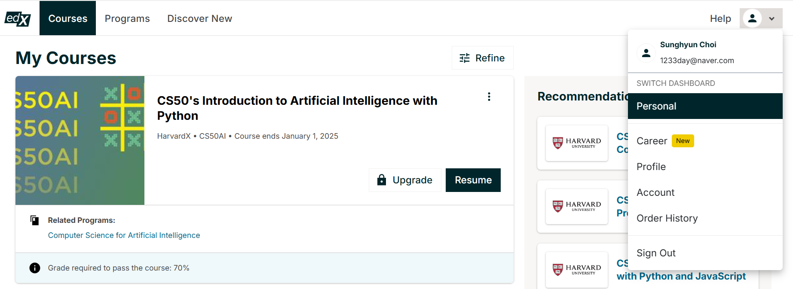
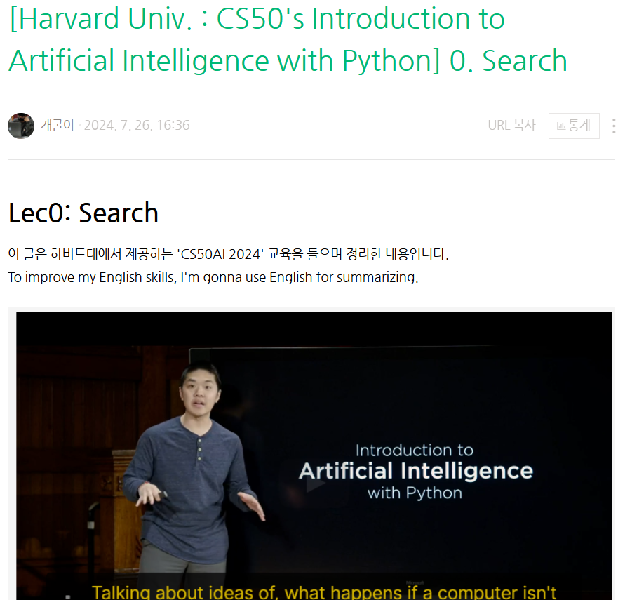

# HarvardX CS50AI - CS50's Introduction to Artificial Intelligence with Python
   

👉 https://courses.edx.org/courses/course-v1:HarvardX+CS50AI+1T2020/

## 📘 CS50AI 2024 course
- Introduction
- Search
- Knowledge
- Uncertainty
- Optimization
- Learning
- Neural Networks
- Language

## 🧐Study
1. ✍ 강의 학습을 통해 개념 정리

2. 👨🏻‍💻 실습을 통해 코드를 경험해 보고 코드 분석

3. 🗂️ 블로그에 학습 정리

   

   👉 https://blog.naver.com/1233day
